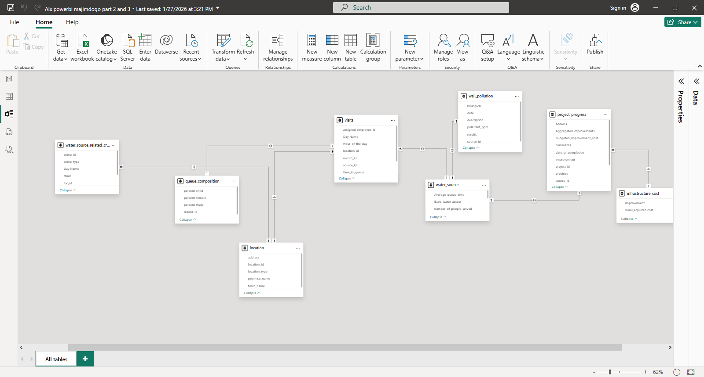

#  Power BI Water Access Analysis – Maji Ndogo

> **Portfolio Project | Power BI | Data Visualization & Analytics**
> **Author:** Shiru

---

##  Project Overview

This project showcases an end-to-end **Power BI analytics workflow**, transforming complex, multi-table data into **interactive, decision‑maker‑focused dashboards**.

The analysis focuses on **water access, queue behavior, pollution, crime correlation, and infrastructure investment** across the fictional country of **Maji Ndogo**.

The report is structured into **two major parts**:

* **Part 2:** National analysis & exploratory visuals
* **Part 3:** Executive, financial & decision‑making dashboards

---

##  Data Model Overview

The Power BI data model was designed using **star and multi‑star schema concepts** to support efficient filtering and cross‑visual interaction.

**Key Tables Used:**

* `visits` (fact table)
* `location`
* `water_source`
* `queue_composition`
* `well_pollution`
* `project_progress`
* `infrastructure_cost`
* `water_source_related_crime`

**Techniques Applied:**

* Relationship modeling
* Power Query transformations
* Calculated columns and measures (DAX)

📸 **Screenshot Placeholder – Data Model**

```

```

---

# 🔹 PART 2: National‑Level Analysis & Visual Exploration

### 🎯 Objective

Provide a **bird’s‑eye view** of water access and usage across Maji Ndogo, while enabling interactive exploration of queues, pollution, and demographics.

---

## 📍 National Overview Page

### Visualizations Created

1. **Filled Map – Provinces of Maji Ndogo**
   Displays water‑related metrics by province with full cross‑filtering support.

2. **Donut Chart – Urban vs Rural Population Split**

3. **Tree Map – Population Served by Water Source Type**

4. **Column Chart – Water Source Types per Town**

5. **Column Chart – Count of Water Sources by Type**

📸 **Screenshot Placeholder – National Overview Dashboard**

```

```

---

## ⏱️ Queue Analysis Page

### Visualizations Created

6. **Map – Queue Analysis by Province**

7. **Stacked Column Chart – Queue Composition by Gender**

8. **Column Chart – Queue Composition by Day of Week**

9. **Line Chart – Queue Composition by Hour of Day**

> This page demonstrates **multi‑visual filtering** and advanced user interaction.

📸 **Screenshot Placeholder – Queue Analysis Dashboard**

```

```

---

## 🧪 Pollution Analysis Page

### Visualizations Created

10. **Map with Color Saturation – Pollution Density**

11. **Composition Chart – Pollution Results**
    (Clean, Chemically Contaminated, Biologically Contaminated)

📸 **Screenshot Placeholder – Pollution Analysis Dashboard**

```

```

---

## 🔗 Crime & Water Source Correlation

12. **Crime‑Linked Water Source Visuals**
    Connects historical crime data to water source locations to explore safety‑access relationships.

📸 **Screenshot Placeholder – Crime & Water Source Analysis**

```

```

---

# 🔹 PART 3: Executive & Financial Decision‑Making Dashboard

### 🎯 Objective

Design a **policy‑maker‑focused dashboard** answering:

* Who lacks access to basic water services?
* What infrastructure upgrades are needed?
* How much will they cost?
* Where should funding be allocated?

---

## 🧠 Executive Summary Section

### Visualizations Created

13. **KPI Cards**

* Total Cost of Upgrades
* Current % of Basic Water Access
* % Improvement After Project Completion

📸 **Screenshot Placeholder – Executive Summary KPIs**

```

```

---

## 💰 Budget & Investment Analysis

### Visualizations Created

14. **Table – Budget Breakdown by Province**

15. **Table – Budget Breakdown by Improvement Type**

16. **Donut / Percentage Chart – Budget Allocation per Province**

📸 **Screenshot Placeholder – Budget Analysis Dashboard**

```

```
```

```
---


---

## 🏙️ Provincial Drill‑Through Pages

17. **Province‑Specific Dashboards**

Each provincial page includes:

* Urban vs Rural population split
* Budget allocation visuals
* Town‑level infrastructure costs
* Drill‑through navigation from the national dashboard

📸 **Screenshot Placeholder – Provincial Dashboard**

```

```

---

## 🛠 Skills Demonstrated

* Power BI Data Modeling
* Power Query (ETL)
* DAX Calculations
* Interactive Dashboard Design
* Bookmarks & Drill‑Through Navigation
* Data Storytelling for Decision‑Makers

---

## 🚀 Portfolio Value

This project demonstrates my ability to:

* Build **production‑style Power BI reports**
* Translate data into **policy and investment insights**
* Design dashboards for **non‑technical stakeholders**
* Apply **real‑world analytics best practices**

---

